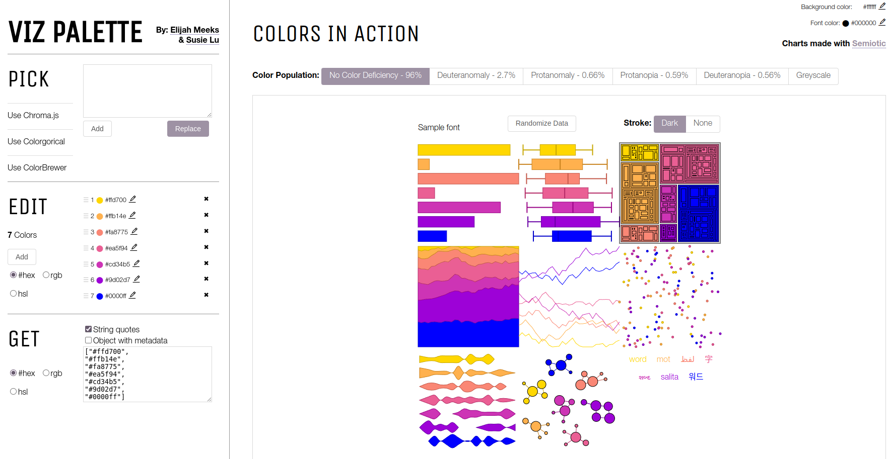

# Colors

!!! danger "All credits go to Barney"
    This page is a copy of Barney Potter's colors page. If in doubt of the right colors, ask him

    _'And never use a rainbow color schema'~ Barney Potter_

Picking good colors is important for both scientific clarity and aesthetics.
Poorly chosen colors may misrepresent data because of color palette artifacts, or make people disinclined to look at a figure because it is ugly.
To that end, I'm dumping color related stuff here so that it is easier to find in the future.

## Useful links

[Viz Palette](https://projects.susielu.com/viz-palette): I use this a lot. Gives you a very quick look at how a set of colors work together. Gives each one a qualitative name, does colorblindness comparisons (that are easy to look at), and lets you tweak the colors pretty easily.

### Papers

Here is a paper on [The misuse of color in science communication](https://www.nature.com/articles/s41467-020-19160-7?source=techstories.org) (Crameri et al. 2020).

### Color palette generators

[i want hue](https://medialab.github.io/iwanthue/): a (semi-random) palette generator for n-colors. They let you determine the parameters of your palette, then use an algorithm to draw colors from those parameters. They give you lots of useful tutorials and examples for how to generate palettes, and have a colorblindness comparison that is a bit hard to parse, but quite helpful.

[colorpicker](https://tristen.ca/hcl-picker/#/clh/7/289/520156/EFB8CB): an easy way to export a palette of n perceptually uniform colors based on the HSLuv palette; it just interpolates between two chosen colors. Super easy to use. They also let you visualize the palette on a choropleth.

[colorbrewer2](https://colorbrewer2.org/#type=sequential&scheme=BuGn&n=3): doesn't give you much control, but it does let you quickly select a good palette among several presets, filtered by things like colorblind friendliness, print friendliness and nature of the data.

[hclwizard](https://hclwizard.org/): has a _lot_ of finicky (though not secure SSL'd) tools for picking colors, visualizing colorblindness, and selecting HCL colors.

[HSLuv](https://www.hsluv.org/): billed as a "human friendly" alternative to HSL. It is designed as a perceputally uniform color space. This website gives some info on the palette, as well as lets you explore and pick a single value from the space. Probably nice for generating a seed hex.

## Discrete color palettes

Some good (and not-so-good) color palettes that I've used for either figures or for my computer setup.

### Gytis' colors

Color palette sent to me by Gytis Dudas that he really likes:
[link](https://projects.susielu.com/viz-palette?colors=[%22#4c72a5%22,%22#48a365%22,%22#d0694a%22,%22#e1c72f%22,%22#cc79a7%22,%22#77bedb%22,%22#7f6e85%22,%22#ccc197%22]&backgroundColor=%22white%22&fontColor=%22black%22&mode=%22normal%22)

-    `#4c72a5`
-    `#48a365`
-    `#d0694a`
-    `#e1c72f`
-    `#cc79a7`
-    `#77bedb`
-    `#7f6e85`
-    `#ccc197`

### [Gruvbox](https://github.com/morhetz/gruvbox)

This [palette](https://projects.susielu.com/viz-palette?colors=[%22#cc241d%22,%22#98971a%22,%22#d79921%22,%22#458588%22,%22#b16286%22,%22#689d6a%22,%22#d65d0e%22,%22#282828%22]&backgroundColor=%22#fbf1c7%22&fontColor=%22#3c3836%22&mode=%22normal%22) makes up the "core" gruvbox palette.

-    `#4c72a5`
-    `#98971a`
-    `#d79921`
-    `#458588`
-    `#b16286`
-    `#689d6a`
-    `#d65d0e`
-    `#282828`

### Dark gruvbox colors

The other option for the above ([link](https://projects.susielu.com/viz-palette?colors=[%22#9d0006%22,%22#79740e%22,%22#b57614%22,%22#076678%22,%22#8f3f71%22,%22#427b58%22,%22#af3a03%22]))

-    `#9d0006`
-    `#79740e`
-    `#b57614`
-    `#076678`
-    `#8f3f71`
-    `#427b58`
-    `#af3a03`

### Gruv candy

Spent some time working with Gytis on [these colors](https://projects.susielu.com/viz-palette?colors=[%22#ff241f%22,%22#79c563%22,%22#ffbb00%22,%22#b4bd00%22,%22#00929f%22,%22#ee759b%22,%22#ff7600%22,%22#b3d6c9%22]&backgroundColor=%22#ffffff%22&fontColor=%22#3c3836%22&mode=%22normal%22), so they are WIP.

-    `#FF241F`
-    `#79C563`
-    `#FFBB00`
-    `#B4BD00`
-    `#00929F`
-    `#EE759B`
-    `#FF7600`
-    `#B3D6C9`
