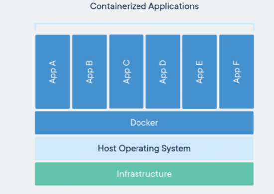

# Docker
Docker is a software platform that allows you to build, test, and deploy applications quickly. Docker packages software into standardized units called containers that have everything the software needs to run including libraries, system tools, code, and runtime.

## Why Docker?
Docker takes away repetitive, mundane configuration tasks and is used throughout the development lifecycle for fast, easy and portable application development – desktop and cloud. How does docker achieve this? It uses containers! **A container** is a standard unit of software that packages up code and all its dependencies so the application runs quickly and reliably from one computing environment to another. A Docker **container image** is a lightweight, standalone, executable package of software that includes everything needed to run an application: code, runtime, system tools, system libraries and settings.

{.center}
> Docker is build on the users hardware and runs applications in containers. Unlike a virtual machine, a container does not need to run a full operating system, making it much more lightweight and efficient.
 
A **Dockerfile** is simply a text-based script of instructions that is used to build a container image. 

For us this then becomes very useful as we can then run each individual process of the pipeline using docker images so all steps are containerized. 

However, a container starts from the image definition each time it starts. While containers can create, update, and delete files, those changes are lost when the container is removed and all changes are isolated to that container. With volumes, we can change all of this.

Volumes provide the ability to connect specific filesystem paths of the container back to the host machine. If a directory in the container is mounted, changes in that directory are also seen on the host machine. If we mount that same directory across container restarts, we'd see the same files.

## Docker Installation
I suggest looking at their official [installation page](https://docs.docker.com/get-docker/).

However, given that most of us are MAC users: 
[Docker Desktop for Mac with Apple silicon](https://desktop.docker.com/mac/main/arm64/Docker.dmg?utm_source=docker&utm_medium=webreferral&utm_campaign=docs-driven-download-mac-arm64){ .md-button }

[Docker Desktop for Mac with Intel chip](https://desktop.docker.com/mac/main/amd64/Docker.dmg?utm_source=docker&utm_medium=webreferral&utm_campaign=docs-driven-download-mac-amd64){ .md-button }

## In depth class
For a more in depth class for users with 0 experience, consider the [course from SIB](https://sib-swiss.github.io/containers-introduction-training/latest/course_material/introduction_containers/). 

Watch their first introductory video:
<iframe width="560" height="315" src="https://www.youtube.com/embed/Qfh80DlF1_4" title="YouTube video player" frameborder="0" allow="accelerometer; autoplay; clipboard-write; encrypted-media; gyroscope; picture-in-picture" allowfullscreen></iframe>

### Cheatsheet

#### Running docker interactive
Interactive is stated with `-it` 
Giving it access to the local directory to load in some data is done with [defining volumes](https://docs.docker.com/storage/volumes/)
```bash
docker run -it --mount type=bind,source=$PWD,target=/workdir
```