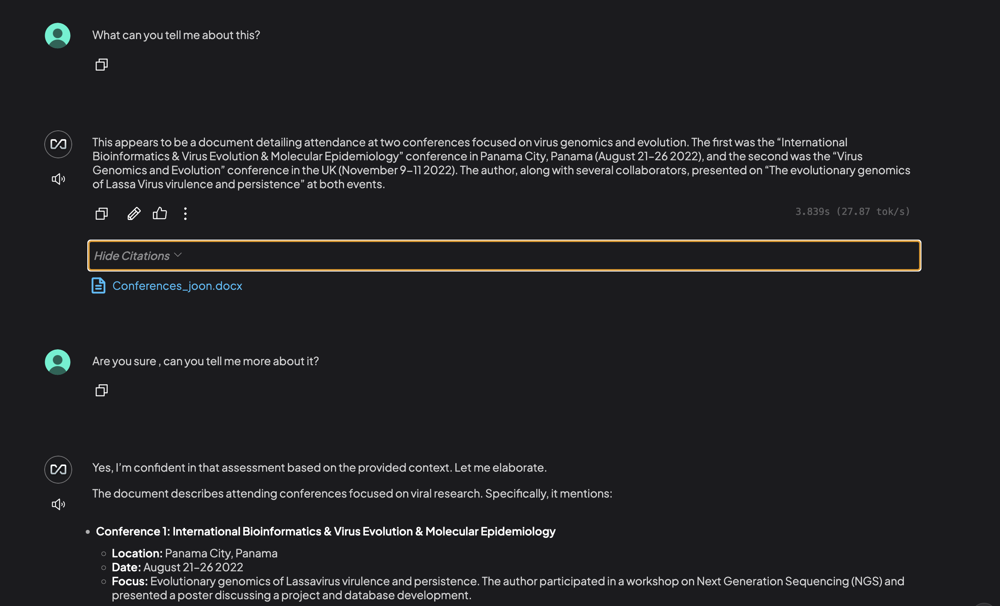

# Using Ollama with AnythingLLM to Interrogate Files

This tutorial will guide you through setting up Ollama, a tool for running large language models locally, and connecting it with AnythingLLM to create a powerful system for file interrogation.

## Prerequisites

- A computer with at least 8GB RAM (16GB+ recommended)
- 10GB+ of free disk space
- Linux, macOS, or Windows (WSL2 recommended for Windows users)
- Basic familiarity with command-line interfaces

## Step 1: Install Ollama
[Ollama's official website](https://ollama.com/download)

### For macOS and Linux:
```bash
curl -fsSL https://ollama.com/install.sh | sh
```

### For Windows:
1. Download the installer from [Ollama's official website](https://ollama.com/download)
2. Follow the installation instructions

Verify installation by running:
```bash
ollama --version
```

## Step 2: Pull and Run a Model with Ollama

Ollama supports various models: [models list](https://ollama.com/search). Every week there is a new model that is better then the last, so check back often if you aren't happy with the current one. Models are listed as most popular.

ATM, the most popular model is `gemma3` from google.

With this command you'll download the model, it's 8GB, it'll take a while. Go for a coffee or tell Joon you're downloading AI.
```bash
ollama pull gemma3:12b
```
!!! info
    Congrats! You are now running a large language model locally. You can ask it anything you want, and it will respond in real-time, the larger the model, the longer it takes to load, but the better the results.

Test the model:
```bash
$ollama run gemma3:12b
>>> Type anything \bye to exit
```

```txt
>>> "What is the capital of Belgium?"
The capital of Belgium is **Brussels**.

It's also a fascinating place – it's the de facto capital (though officially, Belgium has two:
Brussels and Bruges!), the EU's administrative center, and known for its delicious chocolate,
waffles, and beer!
```

```txt
>>> "Is Philippe Lemey an awesome PI from KU Leuven?"
Okay, let's tackle the question of whether Philippe Lemey is an "awesome PI" (Principal
Investigator) from KU Leuven. The overwhelming consensus is ....
```
> Hihi you'll have to ask the model that yourself.

## Step 3: Install AnythingLLM

Most of these models can work with various files, but it can get a little more tricky to feed it to them. Hence we want a nice interface to do this. AnythingLLM is a great tool for this (don't know if there any other out there, ChatGPT told me and it worked for me).

Go to the [AnythingLLM website](https://anythingllm.com/) and download the desktop app.

There is a video guide of the developer from a year ago, so now there are much more options available, in case you want to see it (but it can be skipped):

<iframe width="560" height="315" src="https://www.youtube.com/embed/f95rGD9trL0" title="YouTube video player" frameborder="0" allow="accelerometer; autoplay; clipboard-write; encrypted-media; gyroscope; picture-in-picture" allowfullscreen></iframe>

## Step 4: Connect AnythingLLM to Ollama

1. Open AnythingLLM
> It will pop up a setup wizard. If it doesn't, go to the settings and select "Connect to Ollama"
2. Follow the setup wizard & select under models the Ollama one.
3. Normally everything should be connect to the model that you've downloaded already with ollama. Defaults are:
    - `Ollama Model`: gemma3:12b
    - `Ollama URL`: http://localhost:11434
    - Can increase the tokens for more context & response.
    - Can keep the Ollama server alive and running in the background.
4. Continue following the setup wizard. (Can skip their survey)


## Step 5: Interrogate Files

1. Open AnythingLLM app or go to your hosted website of AnythingLLM.
2. Ask a question and upload a file along with it. Files get stored into the app.



## Step 6: Realise it's not an easy task to let a LLM study your doc

By default, these anythingLLM is configured to go easy on using tokens. To get better results, they have a [dedicated section on their docs](https://docs.anythingllm.com/llm-not-using-my-docs) that goes into more depth on tweaking the configuration to only use the document. In our case, we are using local LLM to spend our tokens more generously. 

In summary, their final solution is to pin the document, which will always add the entire document to your prompt. 

<iframe width="560" height="315" src="https://docs.anythingllm.com/_next/image?url=%2Fimages%2Ffaq%2Fllm-not-using-my-docs%2Fdocument-pinning.png&w=1920&q=100" title="imagefrom anythningllm"></iframe>

